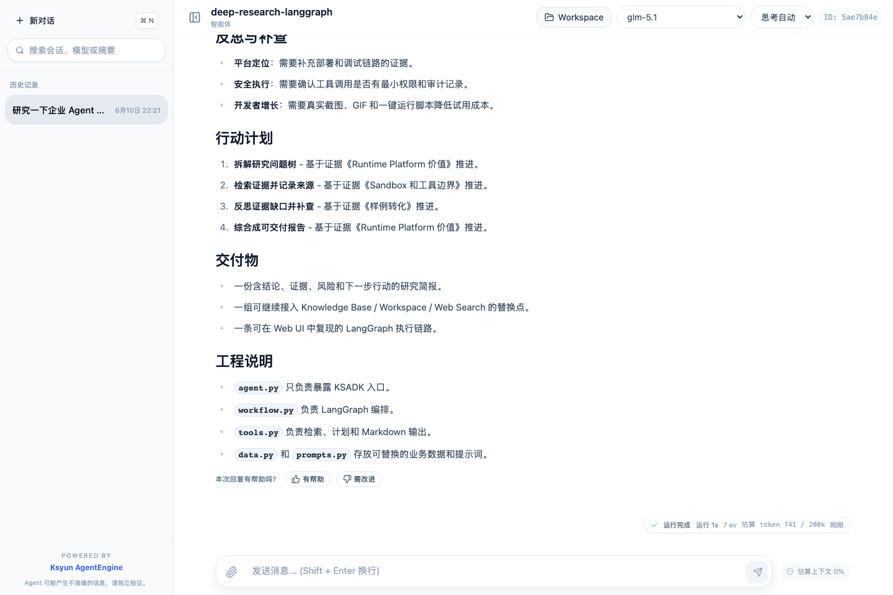

# 深度研究 Agent（Deep Research）- LangGraph

把开放式问题拆成研究计划、证据卡片、风险假设和交付大纲。这是一个多文件 LangGraph Agent 工程，不是单文件脚本；默认使用本地公开示例数据，所以 clone 后不配置模型也能看到完整演示。

这个样例的工程形态参考了 DeerFlow、ADK Deep Search 等成熟 Deep Research Agent 的常见闭环：先计划，再检索，再反思补查，最后综合成可交付报告。为了保持开源样例可复现，这里用本地数据模拟搜索和反思阶段；接入真实环境时，可以把 `tools.py` 中的检索函数替换为 Web Search、Knowledge Base 或 Workspace 文件读取。

## 适用场景

- 想学习如何把 Deep Research Agent 写成可维护的 KSADK 工程。
- 想在不配置外部服务的情况下，先看到一个完整 Agent 推理链路。
- 想把本地示例数据替换为知识库、Workspace、Sandbox 或业务 API。

## 工程结构

| 文件 | 作用 |
| --- | --- |
| `agent.py` | KSADK 入口，只暴露 `ksadk_prepare_state` 和 `root_agent`。 |
| `workflow.py` | 装配 LangGraph 节点和场景配置。 |
| `tools.py` | 场景工具层，负责检索证据、规划行动和渲染 Markdown。 |
| `data.py` | 本地公开示例数据，可替换为真实知识库或 API。 |
| `prompts.py` | 角色设定和输出要求。 |
| `demo.py` | 离线演示脚本，一条命令打印完整 Markdown 结果。 |

## 你会看到什么

- `classify_intent`：确定用户意图。
- `collect_context`：从本地示例数据里取证据卡片。
- `plan_next_steps`：把证据转成行动计划。
- `finalize_answer`：输出适合 Web UI 展示的 Markdown。

最终回答会包含：

- `研究计划`：展示 Agent 如何拆解任务。
- `执行轨迹`：展示每张证据卡片来自哪个检索角度。
- `反思与补查`：展示当前证据还缺什么，方便继续接真实搜索。
- `交付物`：说明这个 Agent 最终应该产出什么，而不是只聊天。

## 环境准备

在仓库根目录执行：

```bash
uv venv
uv pip install -e ".[test]"
uv pip install -U "ksadk[all]"
```

这个样例默认不需要模型 key；如果你想把工具结果交给真实 LLM 改写，可以在 `.env` 中配置：

```bash
OPENAI_API_KEY=your-openai-compatible-api-key
OPENAI_MODEL_NAME=gpt-4o-mini
```

## 本地运行

```bash
cd 02-use-cases/deep-research/langgraph
cp ../../../.env.example .env
uv pip install -r requirements.txt
uv run agentengine run -i .
```

如果只想快速看演示效果，可以直接运行：

```bash
uv run python demo.py
```

## Web UI 调试

```bash
uv run agentengine web .
```

Web UI 中可以观察每次输入如何进入 LangGraph，并看到最终 Markdown 回答。这个样例的输出包含结论、证据卡片、行动计划和工程说明，很适合录制 GIF 或截图。

真实 Web UI 效果：



## 部署

```bash
uv run agentengine deploy .
```

部署前建议先跑一次本地 Web UI，并确认 README 中的示例问题能返回稳定结果。

## 示例问题

- `研究一下企业 Agent Runtime Platform 的选型维度。`
- `帮我做一个 KsADK 和单框架 Agent SDK 的调研提纲。`

## 演示亮点

- 多文件 Agent 工程，适合客户复制后改造成真实项目。
- 默认离线可跑，不依赖云端知识库或真实账号。
- 代码注释解释了如何替换成本地文件、知识库、业务 API 或平台工具。
- 输出包含研究计划、执行轨迹、证据、反思补查、行动计划和工程说明，适合录制 GIF 或截图。

## 常见问题

- 如果运行时报 `langgraph` 缺失，请确认已安装 `ksadk[langgraph]` 或 `ksadk[all]`。
- 如果想接入真实模型，请在 `.env` 中设置 `OPENAI_API_KEY`、`OPENAI_MODEL_NAME`，必要时设置 `OPENAI_BASE_URL`。
- 如果要接入 KSADK Knowledge Base，把 `tools.py` 中的本地检索替换为 `ksadk.knowledge_base.tool.search_knowledge`。
- 如果要让 Agent 写文件或执行代码，请优先接入 Workspace / Sandbox 工具，不要直接访问任意宿主机目录。
