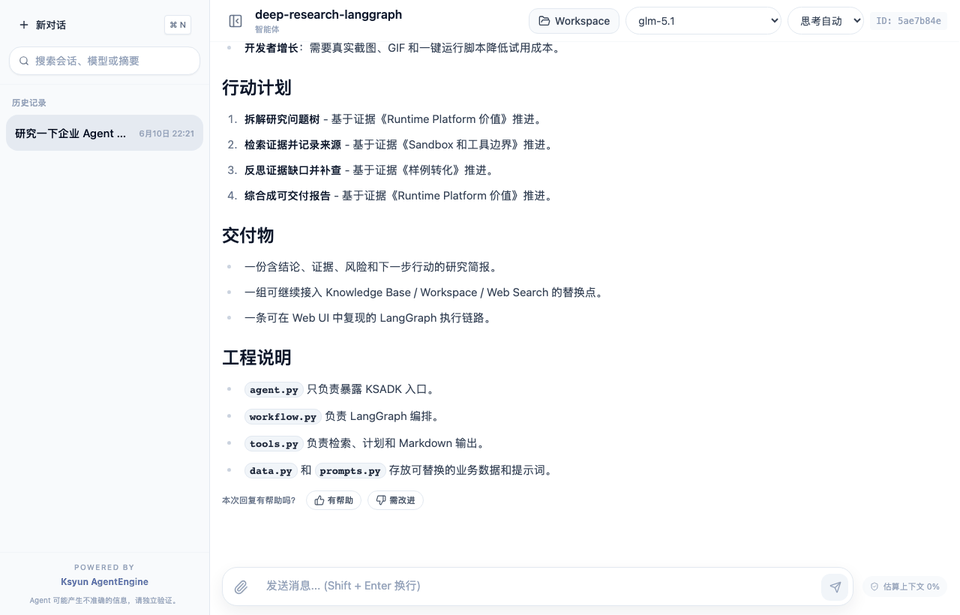

# KSADK 样例（Samples）

[![zread](https://img.shields.io/badge/Ask_Zread-_.svg?style=flat&color=00b0aa&labelColor=000000&logo=data%3Aimage%2Fsvg%2Bxml%3Bbase64%2CPHN2ZyB3aWR0aD0iMTYiIGhlaWdodD0iMTYiIHZpZXdCb3g9IjAgMCAxNiAxNiIgZmlsbD0ibm9uZSIgeG1sbnM9Imh0dHA6Ly93d3cudzMub3JnLzIwMDAvc3ZnIj4KPHBhdGggZD0iTTQuOTYxNTYgMS42MDAxSDIuMjQxNTZDMS44ODgxIDEuNjAwMSAxLjYwMTU2IDEuODg2NjQgMS42MDE1NiAyLjI0MDFWNC45NjAxQzEuNjAxNTYgNS4zMTM1NiAxLjg4ODEgNS42MDAxIDIuMjQxNTYgNS42MDAxSDQuOTYxNTZDNS4zMTUwMiA1LjYwMDEgNS42MDE1NiA1LjMxMzU2IDUuNjAxNTYgNC45NjAxVjIuMjQwMUM1LjYwMTU2IDEuODg2NjQgNS4zMTUwMiAxLjYwMDEgNC45NjE1NiAxLjYwMDFaIiBmaWxsPSIjZmZmIi8%2BCjxwYXRoIGQ9Ik00Ljk2MTU2IDEwLjM5OTlIMi4yNDE1NkMxLjg4ODEgMTAuMzk5OSAxLjYwMTU2IDEwLjY4NjQgMS42MDE1NiAxMS4wMzk5VjEzLjc1OTlDMS42MDE1NiAxNC4xMTM0IDEuODg4MSAxNC4zOTk5IDIuMjQxNTYgMTQuMzk5OUg0Ljk2MTU2QzUuMzE1MDIgMTQuMzk5OSA1LjYwMTU2IDE0LjExMzQgNS42MDE1NiAxMy43NTk5VjExLjAzOTlDNS42MDE1NiAxMC42ODY0IDUuMzE1MDIgMTAuMzk5OSA0Ljk2MTU2IDEwLjM5OTlaIiBmaWxsPSIjZmZmIi8%2BCjxwYXRoIGQ9Ik0xMy43NTg0IDEuNjAwMUgxMS4wMzg0QzEwLjY4NSAxLjYwMDEgMTAuMzk4NCAxLjg4NjY0IDEwLjM5ODQgMi4yNDAxVjQuOTYwMUMxMC4zOTg0IDUuMzEzNTYgMTAuNjg1IDUuNjAwMSAxMS4wMzg0IDUuNjAwMUgxMy43NTg0QzE0LjExMTkgNS42MDAxIDE0LjM5ODQgNS4zMTM1NiAxNC4zOTg0IDQuOTYwMVYyLjI0MDFDMTQuMzk4NCAxLjg4NjY0IDE0LjExMTkgMS42MDAxIDEzLjc1ODQgMS42MDAxWiIgZmlsbD0iI2ZmZiIvPgo8cGF0aCBkPSJNNCAxMkwxMiA0TDQgMTJaIiBmaWxsPSIjZmZmIi8%2BCjxwYXRoIGQ9Ik00IDEyTDEyIDQiIHN0cm9rZT0iI2ZmZiIgc3Ryb2tlLXdpZHRoPSIxLjUiIHN0cm9rZS1saW5lY2FwPSJyb3VuZCIvPgo8L3N2Zz4K&logoColor=ffffff)](https://zread.ai/kingsoftcloud/ksadk-python)

KSADK Samples 是 AgentEngine / KSADK 的官方场景化代码工坊。仓库默认使用中文 README 和中文注释；`Samples` 和 `Examples` 都表示可运行、可部署、可对比框架写法的公开样例。

样例设计会持续参考 ADK Samples、VEADK Examples、AgentKit Samples、DeerFlow、SWE-agent / OpenHands / Aider 等优秀开源 Agent 项目；维护侧对标原则见 [Agent 样例对标笔记](docs/agent-sample-benchmarks.md)。

## 场景导航

### 按场景选择

| 场景 | 推荐样例 | 覆盖框架 |
| --- | --- | --- |
| 基础 Agent（Basic Agent） | `01-tutorials/hello-world` | Built With ADK / Built With LangGraph / Built With LangChain / Built With DeepAgents |
| 工具调用 Agent（Tool-Using Agent） | `01-tutorials/tool-calling` | Built With ADK / Built With LangGraph / Built With LangChain / Built With DeepAgents |
| 记忆增强 Agent（Memory-aware Agent） | `01-tutorials/memory` | Built With ADK / Built With LangGraph / Built With LangChain / Built With DeepAgents |
| 知识助手（Knowledge Assistant） | `02-use-cases/knowledge-base-rag` | Built With ADK / Built With LangGraph / Built With LangChain / Built With DeepAgents |
| 工作流 Agent（Workflow Agent） | `02-use-cases/agentengine-toolsets/langgraph` | Built With LangGraph |
| 深度研究 Agent（Deep Research Agent） | `02-use-cases/deep-research/langgraph` | Built With LangGraph |
| 编码 Agent（Coding Agent） | `02-use-cases/coding-agent/langgraph` | Built With LangGraph |
| 浏览器 Agent（Browser Agent） | `02-use-cases/browser-agent/langgraph` | Built With LangGraph |
| 数据分析 Agent（Data Analyst） | `02-use-cases/data-analyst/langgraph` | Built With LangGraph |
| 客服 Agent（Customer Support） | `02-use-cases/customer-support/langgraph` | Built With LangGraph |
| 多 Agent 团队（Multi-Agent Team） | `02-use-cases/multi-agent-team/langgraph` | Built With LangGraph |
| 运维告警 Agent（AIOps） | `02-use-cases/aiops/incident-triage-langgraph` | Built With LangGraph / Built With ADK / Built With LangChain / Built With DeepAgents |
| 财务审阅 Agent（Finance） | `02-use-cases/finance/report-review-langgraph` | Built With LangGraph / Built With ADK / Built With LangChain / Built With DeepAgents |

### 最佳实践案例

| 目标 | LangGraph | ADK | LangChain | DeepAgents |
| --- | --- | --- | --- | --- |
| Deep Research 报告生成 | `02-use-cases/deep-research/report-writer-langgraph` | `02-use-cases/deep-research/report-writer-adk` | `02-use-cases/deep-research/report-writer-langchain` | `02-use-cases/deep-research/report-writer-deepagents` |
| Coding Workspace + Sandbox | `02-use-cases/coding-agent/workspace-sandbox-langgraph` | `02-use-cases/coding-agent/workspace-sandbox-adk` | `02-use-cases/coding-agent/workspace-sandbox-langchain` | `02-use-cases/coding-agent/workspace-sandbox-deepagents` |
| Browser DOM 诊断 | `02-use-cases/browser-agent/dom-diagnostics-langgraph` | `02-use-cases/browser-agent/dom-diagnostics-adk` | `02-use-cases/browser-agent/dom-diagnostics-langchain` | `02-use-cases/browser-agent/dom-diagnostics-deepagents` |
| Data Analyst CSV 洞察 | `02-use-cases/data-analyst/csv-insight-langgraph` | `02-use-cases/data-analyst/csv-insight-adk` | `02-use-cases/data-analyst/csv-insight-langchain` | `02-use-cases/data-analyst/csv-insight-deepagents` |
| Customer Support 工单分级 | `02-use-cases/customer-support/ticket-triage-langgraph` | `02-use-cases/customer-support/ticket-triage-adk` | `02-use-cases/customer-support/ticket-triage-langchain` | `02-use-cases/customer-support/ticket-triage-deepagents` |
| Multi-Agent Team 协作交付 | `02-use-cases/multi-agent-team/team-delivery-langgraph` | `02-use-cases/multi-agent-team/team-delivery-adk` | `02-use-cases/multi-agent-team/team-delivery-langchain` | `02-use-cases/multi-agent-team/team-delivery-deepagents` |
| AIOps 告警分诊 | `02-use-cases/aiops/incident-triage-langgraph` | `02-use-cases/aiops/incident-triage-adk` | `02-use-cases/aiops/incident-triage-langchain` | `02-use-cases/aiops/incident-triage-deepagents` |
| Finance 报表审阅 | `02-use-cases/finance/report-review-langgraph` | `02-use-cases/finance/report-review-adk` | `02-use-cases/finance/report-review-langchain` | `02-use-cases/finance/report-review-deepagents` |

### 推荐主推 Demo

```bash
cd 02-use-cases/agentengine-toolsets/langgraph
uv pip install -r requirements.txt
uv run agentengine run -i .
```

这个 demo 展示 LangGraph 如何绑定 AgentEngine Toolsets，并覆盖 Skill Space、Skill Runtime、Workspace、Sandbox、知识库和长期记忆的配置边界。未配置平台能力时，demo 会解释缺失项和降级行为，不伪造平台结果。

### 真实 Web UI 演示

下面是 `02-use-cases/deep-research/langgraph` 在本地 `agentengine web` 中的真实问答录制，展示了一个 LangGraph Deep Research Agent 如何输出研究计划、执行轨迹、证据卡片、反思补查和交付物。



## 环境准备

仓库根目录开发：

```bash
uv venv
uv pip install -e ".[test]"
```

单个样例运行：

```bash
cd 01-tutorials/hello-world/adk
cp ../../../.env.example .env
uv pip install -r requirements.txt
uv run agentengine run -i .
uv run agentengine web .
```

```bash
uv pip install -U "ksadk[all]"
```

每个样例默认读取“当前样例目录”的 `.env`。如果你习惯在仓库根目录维护一份 `.env`，请先 `source .env` 或把它复制到要运行的样例目录。

最小 `.env`：

```bash
OPENAI_API_KEY=your-openai-compatible-api-key
OPENAI_MODEL_NAME=gpt-4o-mini
```

非默认 OpenAI endpoint 时再设置 `OPENAI_BASE_URL`；完整能力集可直接安装 `ksadk[all]`。

## 平台能力配置速查

只配置模型时，大多数基础样例可运行；下面变量只在对应能力需要时填写。

| 能力 | 关键环境变量 | 未配置时 |
| --- | --- | --- |
| 云账号 | `KSYUN_ACCESS_KEY`、`KSYUN_SECRET_KEY`、`KSYUN_REGION=cn-beijing-6` | 不能部署或调用云服务 |
| Skill Space | `KSADK_SKILL_SPACE_IDS` / `SKILL_SPACE_ID`、`KSADK_PUBLIC_SKILL_SPACE_IDS`、`KSADK_SKILL_SERVICE_URL`、`KSADK_SKILL_SERVICE_ACCESS_KEY` | 只能提示缺少 Space、endpoint 或凭证 |
| Skill Runtime | `KSADK_SKILL_RUNTIME_BACKEND`、`KSADK_SKILL_RUNTIME_AGENT_PATH`、`KSADK_SKILL_RUNTIME_TEMPLATE_ID`、`E2B_API_KEY` | 可发现 Skill，但不执行 workflow |
| Workspace | 本地 `agentengine run/web` 自动注入；远端由 AgentEngine runtime 注入 | 不能读写会话 workspace 文件 |
| Sandbox | `KSADK_SANDBOX_BACKEND=e2b`、`KSADK_SANDBOX_TEMPLATE_ID`、`KSADK_SANDBOX_TIMEOUT`、`E2B_API_KEY` | `run_command` / `run_code` 返回不可用 |
| 知识库 | `KSADK_KB_DATASET_ID`、`KSADK_KB_ENDPOINT`、`KSADK_KB_REGION`、`KSADK_KB_TOP_K` | RAG demo 使用本地 corpus |
| 长期记忆 | `KSADK_LTM_BACKEND`、`KSADK_LTM_INDEX`、`KSADK_LTM_NAMESPACE`、`KSADK_LTM_HTTP_URL` | 记忆 demo 使用本地示例记忆 |

完整解释见主推 demo：[02-use-cases/agentengine-toolsets/langgraph/README.md](02-use-cases/agentengine-toolsets/langgraph/README.md)。

## 相关资源

- 文档：https://kingsoftcloud.github.io/ksadk-python/
- KSADK 仓库：https://github.com/kingsoftcloud/ksadk-python
- Wiki：https://zread.ai/kingsoftcloud/ksadk-python
- Web UI 仓库：https://github.com/kingsoftcloud/ksadk-web
- PyPI：https://pypi.org/project/ksadk/
- 开源协议：Apache-2.0

## 仓库校验

```bash
uv run python scripts/validate_samples.py
uv run pytest -q
make public-preflight
```

`validate_samples.py` 会检查样例结构、README 必备章节、Python 语法 smoke 和敏感内容扫描；`public-preflight` 是公开同步或发布前门禁。

## 后续计划

后续会继续补充更多框架版本和更重的行业样例。新增样例只有在本地可运行、可部署、可脱敏验证、README 足够完整时，才会加入代码目录。

- 为更多场景补充框架版本；当前报告生成、工作区沙箱、浏览器 DOM 诊断、CSV 洞察、工单分级、团队协作、AIOps 告警分诊和财务报表审阅已覆盖 LangGraph / ADK / LangChain / DeepAgents。
- 增加更多真实 Web UI GIF 和端到端部署录屏；当前已提供 Deep Research Web UI 演示。
- 增加更多行业场景，如内容生产、企业知识运营、销售运营和合规审阅。
